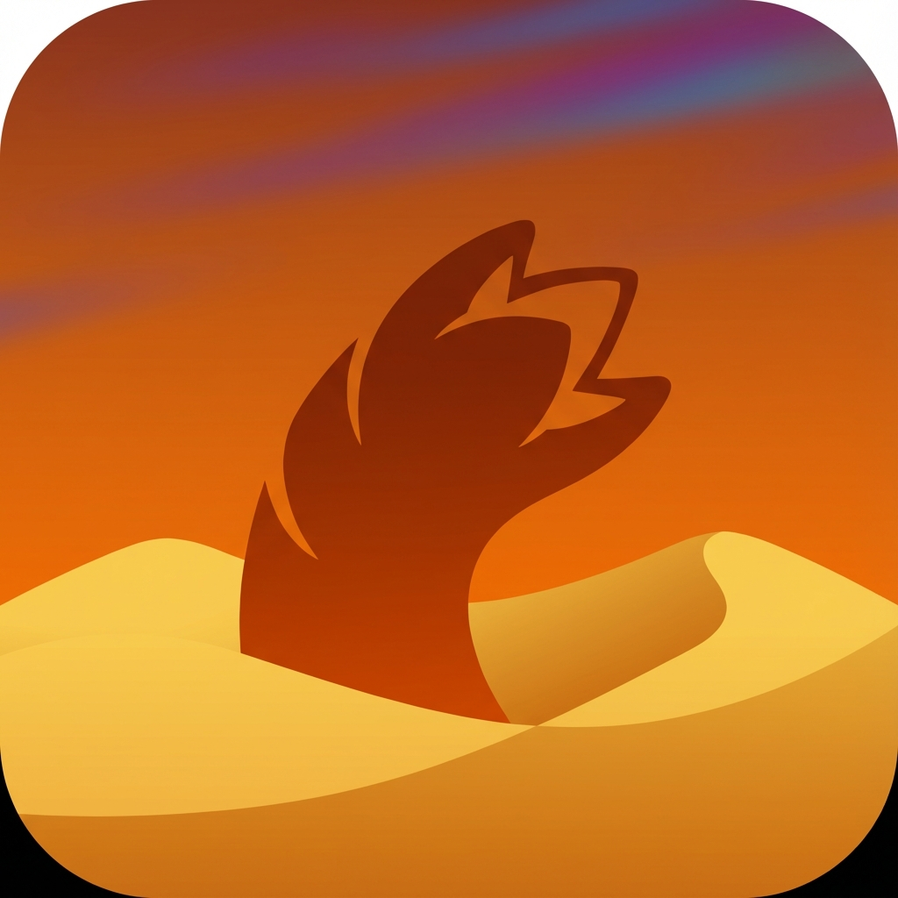

#  Dune Awakening Companion App

A cross-platform companion application for managing characters, bases, power countdowns, and taxes in **Dune Awakening**.

[](https://github.com/StarTuz/dune-awakening-companion)
[](https://flutter.dev)
[](LICENSE)
[](https://github.com/StarTuz/dune-awakening-companion/releases)

> ⚠️ **Disclaimer:** This is an unofficial, fan-made companion app. NOT affiliated with, endorsed by, or supported by Funcom.

---

## ✨ Features

### 🎮 Multi-Character Management
- Track **unlimited characters** across all Dune Awakening servers
- **Official Servers:** 227 worlds across 5 regions (North America, Europe, Asia, Oceania, South America)
- **Private Servers:** Support for 5 major hosting providers (GPORTAL, BisectHosting, xREALM, 4NetPlayers, Nitrado)
- Full character context: Name, Region, World, Sietch
- **📸 Character Portraits:** Add custom images from in-game screenshots!

### 🏰 Unlimited Base Tracking
- Manage **unlimited bases** per character
- Individual power countdown tracking (Days/Hours/Minutes)
- Color-coded status indicators:
  - 🔴 **Red:** < 6 hours (Critical)
  - 🟡 **Yellow:** < 24 hours (Warning)  
  - 🟢 **Green:** > 24 hours (Safe)
- Easy refuel updates via edit dialog

### 💰 Advanced Tax Tracking
- Complete tax management for **Advanced Fiefs**
- **Tax Per Cycle** with built-in calculator (4,000 base + Stakes × 2,000)
- **Smart Auto-Increment:** Detects missed tax cycles when editing
- Separate tracking for:
  - Current Owed (current cycle)
  - Overdue Owed (grace period: < 14 days)
  - Defaulted Owed (shields down: > 14 days)
- Status badges: PAID / DUE / OVERDUE / DEFAULTED

### 🔔 Notifications & System Tray
- **Desktop:** System tray integration with right-click menu
  - Show Window, Check Alerts, Toggle Notifications, Quit
  - Window close minimizes to tray (doesn't quit)
- **Mobile:** Background WorkManager checks
- Configurable check intervals (15/30/60 minutes)
- Power alerts (⚡ Power Critical!)
- Tax alerts (💰 Tax Overdue!)

### 📤 Data Management
- **Export:** Backup all data to JSON files
- **Import:** Restore from backups with Merge or Replace modes
- Custom save/load locations via file picker
- Platform-agnostic (works on all platforms)

### 🔔 Smart Alert System
- Automatic alerts for bases expiring in < 48 hours
- Visual alert badge showing count
- Color-coded alert icon (Red < 24h, Yellow < 48h)
- Detailed alerts screen with:
  - Base severity labels (CRITICAL/WARNING)
  - Full character context
  - Time remaining for both Power and Taxes
  - One-tap navigation to manage bases

### 📊 Dashboard Overview
- Real-time statistics from database
- Character and base counts
- Expiring Soon count (< 48h)
- Active Alerts count (< 24h or critical tax)
- Pull-to-refresh support

### 🌍 Multi-Language Support
- **7 Languages Supported:**
  - 🇬🇧 English
  - 🇪🇸 Spanish
  - 🇫🇷 French
  - 🇩🇪 German
  - 🇺🇦 Ukrainian
  - 🇮🇹 Italian
  - 🏴󠁧󠁢󠁷󠁬󠁳󠁿 Welsh
- **Instant Switch:** Change languages instantly from Settings
- **Persistence:** Remembers your preference across restarts
- **Comprehensive:** Localized titles, alerts, messages, and dates

### 🎨 Adaptive Design
- **Desktop:** Side navigation rail
- **Mobile:** Bottom navigation bar
- Dune-themed color palette
- Responsive layouts

---

## 📥 Download & Install

**[👉 Get the Latest Release Here](https://github.com/StarTuz/dune-awakening-companion/releases/latest)**

| Platform | Instructions |
|----------|--------------|
| 🪟 **Windows** | Download the `.zip` file. Extract it and run `dune_awakening_companion.exe`. If it fails to open, run the included installer for Visual C++. |
| 🐧 **Linux** | Download the `.tar.gz`. Extract and run `./dune_awakening_companion` from the extracted folder. **See Linux requirements below.** |
| 🤖 **Android** | Download the `.apk` file and install it on your device. |
| 🍎 **macOS** | Download the `.zip`, extract, and look for the `.app` file. |

### 🐧 Linux Requirements

The system tray feature requires `libayatana-appindicator`. Install it before running:

**Arch Linux:**
```bash
sudo pacman -S libayatana-appindicator
```

**Ubuntu/Debian:**
```bash
sudo apt-get install libayatana-appindicator3-1
```

**Fedora:**
```bash
sudo dnf install libayatana-appindicator-gtk3
```

---

## 🛠️ Building from Source (Developers)

### Prerequisites
- Flutter SDK 3.x or higher
- Dart 3.x or higher
- For Linux desktop: `libsqlite3-dev`
- For Windows desktop: [Microsoft Visual C++ Redistributable](https://aka.ms/vs/17/release/vc_redist.x64.exe)

### Setup

1. **Clone the repository** (Requires Git)
   ```bash
   git clone https://github.com/StarTuz/dune-awakening-companion.git
   cd dune-awakening-companion
   ```

2. **Switch to Beta branch**
   ```bash
   git checkout Beta
   ```

3. **Install dependencies**
   ```bash
   flutter pub get
   ```

4. **Run the app**
   ```bash
   # Desktop (Linux)
   flutter run -d linux

   # Desktop (Windows)
   flutter run -d windows

   # Desktop (macOS)
   flutter run -d macos

   # Android
   flutter run -d android

   # Hot reload: press 'r'
   # Hot restart: press 'R'
   ```

---

## 📱 Usage

### Adding Your First Character

1. Navigate to the **Characters** screen
2. Tap the **+** button
3. Fill in character details:
   - Character name
   - (Optional) Tap the circle to add a portrait
   - Select your region
   - Choose server type (Official or Private)
   - Select or enter your world/server name
   - Enter your Sietch name
4. Tap **Save**

### Managing Bases

1. On the **Characters** screen, click the **"Bases"** button on your character card
2. In the base management dialog:
   - **Add Base:** Tap the floating **+** button
     - Enter base name
     - Set power countdown (Days/Hours/Minutes from in-game)
     - (Optional) Enable Advanced Fief for tax tracking
   - **Edit Base:** Tap the edit (✏️) icon to update countdown after refueling
   - **Delete Base:** Tap the delete (🗑️) icon

### Monitoring Alerts

1. Navigate to the **Alerts** screen
2. View all bases expiring in the next 48 hours
3. Alerts are sorted by urgency (most critical first)
4. Each alert shows both Power and Tax countdowns
5. Tap any alert card to jump to the Characters screen

### Backup & Restore

1. Navigate to **Settings** screen
2. **Export Data:** Creates a timestamped JSON backup
3. **Import Data:** 
   - **Merge:** Add backup data to existing data
   - **Replace:** Clear all data, then import backup

---

## 🏗️ Project Structure

```
lib/
├── core/                       # Core functionality
│   ├── database/              # SQLite + migrations (v4)
│   ├── services/              # Notifications, system tray, images
│   ├── providers/             # Riverpod providers
│   └── utils/                 # Constants, helpers
├── features/                   # Feature modules
│   ├── characters/            # Character management + portraits
│   ├── bases/                 # Base tracking + tax system
│   ├── alerts/                # Alert system
│   ├── dashboard/             # Overview screen
│   └── settings/              # Export/import, notifications
├── shared/                     # Shared components
│   ├── navigation/            # Adaptive navigation
│   ├── theme/                 # Dune-themed colors
│   └── widgets/               # Reusable UI components
└── main.dart                   # App entry point
```

---

## 🛠️ Tech Stack

| Component | Technology |
|-----------|------------|
| **Framework** | Flutter 3.x |
| **Language** | Dart |
| **State Management** | Riverpod 2.x |
| **Database** | SQLite (sqflite + sqflite_common_ffi) |
| **Notifications** | flutter_local_notifications |
| **System Tray** | tray_manager, window_manager |
| **Architecture** | Feature-first, Repository pattern |
| **Code Generation** | build_runner, json_serializable |

---

## 📚 Documentation

| Document | Description |
|----------|-------------|
| **[HANDOFF.md](./HANDOFF.md)** | Comprehensive technical documentation |
| **[FAQ.md](./FAQ.md)** | Frequently asked questions |
| **[NEXT_STEPS.md](./NEXT_STEPS.md)** | Development roadmap |
| **[PLAN.md](./PLAN.md)** | Original architecture planning |

---

## 🔮 Roadmap

### ✅ Completed (v1.0-beta)

- [x] Multi-character management
- [x] Unlimited base tracking
- [x] Power countdown system (D/H/M)
- [x] Tax tracking for Advanced Fiefs
- [x] Character portraits
- [x] Export/Import data backups
- [x] Alert system (< 48h warning, < 24h critical)
- [x] Notifications & System Tray
- [x] Adaptive navigation
- [x] Database v4 with migrations
- [x] Multi-language support (i18n)

### 🚧 In Progress

- [ ] Cross-platform testing (Windows, macOS, Android)

### 📋 Future Features

- [ ] Quest Journal (tracking complex multi-step quests)
- [ ] Theme Customization (multiple Dune-inspired themes)
- [ ] Dashboard Charts & Analytics
- [ ] Character Sorting (by server, urgency, name, last updated)
- [ ] Push Notification refinements
- [ ] Cloud Sync (optional, opt-in)

---

## 🤝 Contributing

Contributions are welcome! Please read the contributing guidelines in [HANDOFF.md](./HANDOFF.md) before submitting PRs.

### Development Workflow

1. Fork the repository
2. Create a feature branch (`git checkout -b feature/amazing-feature`)
3. Make your changes
4. Run `flutter analyze` to check for issues
5. Test thoroughly on your target platform(s)
6. Commit your changes (`git commit -m 'Add amazing feature'`)
7. Push to the branch (`git push origin feature/amazing-feature`)
8. Open a Pull Request

---

## 🐛 Known Issues

- Linux: System tray tooltip not supported (gracefully handled)
- Some deprecation warnings from external packages

Please report any issues you encounter on the [Issues page](https://github.com/StarTuz/dune-awakening-companion/issues).

---

## 📝 License

This project is licensed under the MIT License - see the [LICENSE](LICENSE) file for details.

---

## ⚠️ Legal Disclaimer

This is an **unofficial, fan-made** companion application.

- **NOT** affiliated with Funcom
- **NOT** endorsed or supported by Funcom
- Funcom had **no input** in development
- Dune Awakening is a trademark of **Funcom**
- Dune and related elements are trademarks of **Herbert Properties LLC**

Use at your own risk.

---

## 🙏 Acknowledgments

- 🙏 **Herbert Estate** for creating the incredible Dune universe
- 🎮 **Funcom** for developing Dune Awakening
- 🌟 **Dune Awakening community** for game mechanics research
- 💙 **Flutter team** for the amazing framework
- ⚡ **Riverpod** for powerful state management
- 🤖 Created within **Google Antigravity IDE** with Claude Sonnet 4.5

---

## 📞 Support

For questions, suggestions, or issues:
- 📋 [Open an issue](https://github.com/StarTuz/dune-awakening-companion/issues)
- 📖 Check [FAQ.md](./FAQ.md) for common questions
- 📚 Review [HANDOFF.md](./HANDOFF.md) for technical documentation

---

<div align="center">

**Built with ❤️ for the Dune Awakening community**

*May your power stay charged and your taxes stay paid.* 🏜️

</div>
